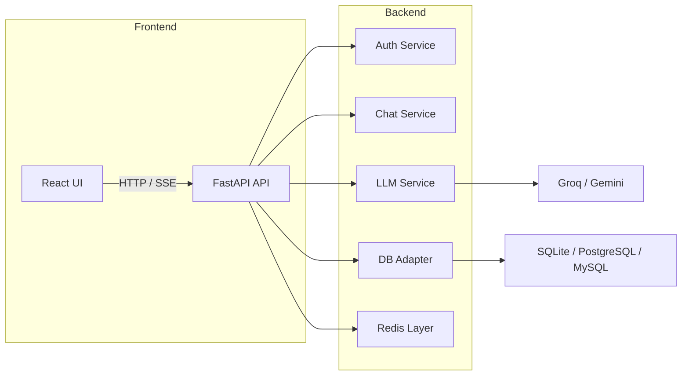
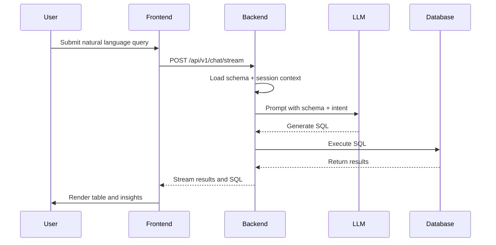
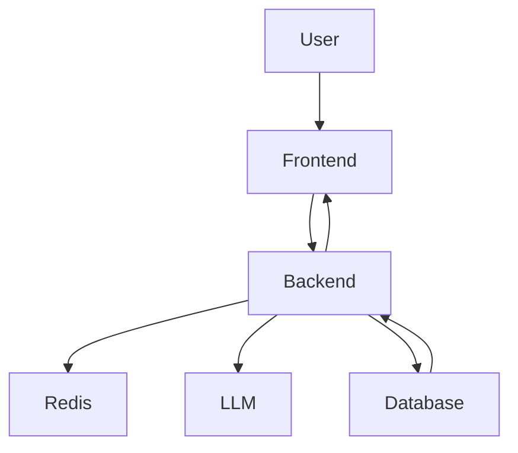
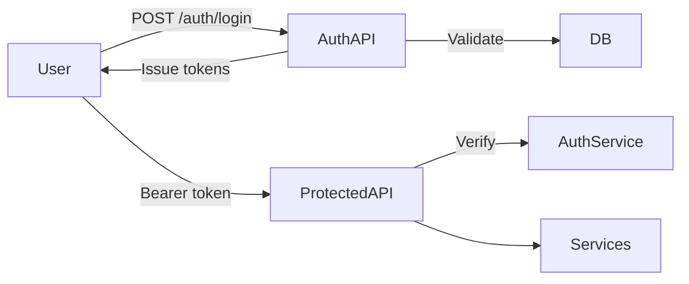
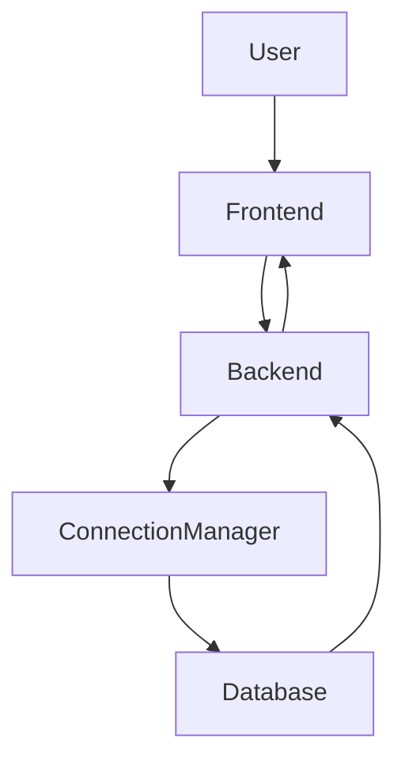
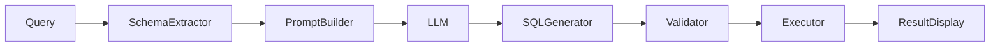

# NexQuery

[Your-AI-Copilot-for-Databases](https://github.com/teja05-45/NexQuery-Your-AI-Copilot-for-Databases)

A production-grade AI SQL assistant built for modern analytics teams, data platforms, and enterprise intelligence stacks. NexQuery combines conversational natural language, schema-aware SQL generation, secure database connectivity, and real-time AI streaming into a unified analytics copilot.

[](https://github.com/teja05-45/NexQuery-Your-AI-Copilot-for-Databases)
[](LICENSE)
[](https://www.python.org/)
[](https://react.dev/)

## Overview

NexQuery is an enterprise-ready conversational analytics platform that turns business questions into executable SQL. It is designed for data engineers, analytics teams, and product leaders who need fast, reliable access to insights across multiple databases without writing manual queries.

### Built for

* Enterprise analytics workflows
* Modern SaaS AI platforms
* Developer-centric analytics operations
* Production-grade data teams

### Platform value

* Fast, schema-aware SQL generation from natural language
* Persistent conversation sessions with query history
* Secure database connectivity across SQLite, PostgreSQL, and MySQL
* Real-time streaming AI responses with interactive result visualization
* Voice-enabled analytics and enterprise authentication

---

## Feature Matrix

| Capability | Enterprise Benefit |
|---|---|
| AI SQL generation | Convert English analytics questions into validated SQL |
| Conversational analytics | Track sessions, context, and follow-up queries |
| Multi-database support | Connect SQLite, PostgreSQL, MySQL in one interface |
| Voice input | Hands-free query builder for rapid adoption |
| SQL visualization | Interactive table results and export workflows |
| JWT authentication | Secure, token-based access control |
| Persistent history | Audit trail and session recall for analysts |
| Redis caching | Fast session state, rate limiting, and cache buffering |
| Streaming responses | Low-latency user experience with SSE updates |
| AI-generated charts | Insight panels for numeric query results |
| Schema understanding | Prompt engineering driven by actual table metadata |
| SQL execution safety | Parameterized SQL and validation layer |
| Syntax highlighting | Professional SQL editor UX |
| Database manager | Dynamic connection testing and profile management |

---

## Technology Stack

### Frontend
* [React](https://react.dev/)
* [Vite](https://vitejs.dev/)
* [Tailwind CSS](https://tailwindcss.com/)
* [Framer Motion](https://www.framer.com/motion/)
* [Zustand](https://github.com/pmndrs/zustand)

### Backend
* [FastAPI](https://fastapi.tiangolo.com/)
* [SQLAlchemy](https://www.sqlalchemy.org/)
* [Alembic](https://alembic.sqlalchemy.org/)
* [Python AsyncIO](https://docs.python.org/3/library/asyncio.html)

### Database
* [SQLite](https://www.sqlite.org/)
* [PostgreSQL](https://www.postgresql.org/)
* [MySQL](https://www.mysql.com/)

### AI / LLM
* [Groq](https://www.groq.com/)
* [Google Gemini](https://developers.google.com/gi)

### DevOps
* [Docker](https://www.docker.com/)
* [Docker Compose](https://docs.docker.com/compose/)

---

## Architecture

### System Architecture



### Layered Architecture

* **Presentation** — React application with SQL editor, dashboard, and schema explorer.
* **API Gateway** — FastAPI routing for auth, chat, SQL execution, and voice.
* **Business Services** — Auth, prompt orchestration, LLM routing, SQL validation.
* **Data Layer** — Async SQLAlchemy, connection manager, persistence.
* **Cache Layer** — Redis for state storage, session buffering, and rate control.

### AI Pipeline



### Request Flow



### Authentication Flow



### Database Connection Flow



### AI Response Pipeline



---

## Workflows

### User Login Workflow
1. User sends credentials to `/api/v1/auth/login`.
2. Backend validates credentials and returns JWT access and refresh tokens.
3. Frontend stores tokens and enables protected routes.
4. All secured endpoints enforce token validation.

### Database Connection Workflow
1. User creates a database profile in the dashboard.
2. Backend tests the connection and extracts schema metadata.
3. Validated connection is persisted for query execution.
4. Active database is used for all subsequent SQL generation.

### AI SQL Generation Workflow
1. User enters a natural language question.
2. Backend merges schema, session state, and prompt templates.
3. LLM provider returns generated SQL.
4. SQL is validated and executed if requested.
5. Results are streamed back to the user interface.

### Query Execution Workflow
1. SQL is routed to the selected database connection.
2. Backend executes through parameterized SQLAlchemy queries.
3. Result set and metadata are returned.
4. Frontend displays tables, export options, and insights.

### Chat Persistence Workflow
1. Conversations are stored in the backend database.
2. Messages are saved with user and session metadata.
3. Users reopen sessions and continue analytics context.

### Voice Query Workflow
1. Frontend records audio from the user.
2. Backend transcribes audio via `/api/v1/voice/transcribe`.
3. Transcription is processed as a normal query.
4. AI generates SQL and returns results.

---

## Folder Structure

```text
NexQuery/
├── backend/
│   ├── app/
│   │   ├── api/routes/            # Auth, Chat, Conversations, Voice, Health
│   │   ├── core/                  # Config, security, dependencies
│   │   ├── db/                    # Async SQLAlchemy engine and session
│   │   ├── logging_config/        # Structured logging setup
│   │   ├── middleware/            # Request and response hooks
│   │   ├── models/                # Domain entities
│   │   ├── prompts/               # Prompt templates and orchestration
│   │   ├── repositories/          # Persistence and data access
│   │   ├── schemas/               # Pydantic request/response models
│   │   ├── services/              # Auth, chat, LLM, voice, Redis
│   │   └── main.py                # FastAPI application entrypoint
│   ├── alembic/                   # Migrations
│   ├── tests/                     # Integration test coverage
│   ├── requirements.txt
│   └── Dockerfile
├── frontend/
│   ├── src/
│   │   ├── api/                   # Axios client, SSE, auth helpers
│   │   ├── components/            # UI modules, editor, tables
│   │   ├── pages/                 # App views and workflows
│   │   ├── routes/                # Protected route wrappers
│   │   ├── store/                 # Zustand state management
│   │   ├── styles/                # Tailwind theme and utilities
│   │   └── App.jsx                # Root React component
│   ├── package.json
│   └── Dockerfile
└── docker-compose.yml
```

### Backend Domains
* **Auth** — JWT, password hashing, protected endpoints.
* **Chat** — session orchestration, message persistence, streaming.
* **LLM** — provider abstraction and prompt routing.
* **DB** — dynamic connection manager and execution layer.
* **Voice** — transcription and synthesis services.
* **Cache** — Redis state, rate limits, and response caching.

### Frontend Domains
* **Dashboard** — active sessions and database manager.
* **Chat** — conversational SQL assistant UX.
* **Database** — connection profiles and schema explorer.
* **Visualizations** — results table, CSV export, insights.
* **Auth** — login, registration, protected route handling.

---

## Database Support

### SQLite
* Local development default.
* File-based `.db` support and fast setup.
* Ideal for proof of concept and embedded analytics.

### PostgreSQL
* Production-grade transactional analytics.
* Supports asyncpg and schema-rich query generation.
* Recommended for enterprise workloads.

### MySQL
* Legacy and distributed data platform compatibility.
* Uses aiomysql for async database operations.

### Connection Management
* Dynamic connection profiles allow multiple database sources.
* Backend validates and tests every new connection.
* Schema extraction ensures AI prompts are informed by actual metadata.

---

## AI Provider Integration

### Groq and Gemini
* Provider abstraction layer enables multi-model deployments.
* `app/services/llm/factory.py` selects the active provider.
* `app/services/llm/base.py` defines the shared interface.
* Provider-specific clients handle request formatting and response normalization.

### Prompt Engineering
* Schema-aware prompt templates create accurate SQL.
* Prompts include guardrails for SELECT-only and analytics-safe SQL.
* Context includes active database schema, session history, and user intent.

---

## Security & Compliance

### Authentication
* Secure JWT access and refresh lifecycle.
* Token validation on every protected route.
* Configurable CORS and auth dependency injection.

### Password Security
* BCrypt hashing for password storage.
* No plaintext credentials persisted.

### SQL Safety
* Parameterized query execution through SQLAlchemy.
* Validation layer prevents unsafe DDL and destructive queries.
* Read-only protections available via database profile configuration.

### API Protection
* Request validation using Pydantic models.
* Redis-backed rate limiting and session caching.
* Secure headers and middleware enforcement.

---

## Setup Instructions

### Backend Setup

```bash
cd backend
python -m venv venv
venv\Scripts\activate
pip install -r requirements.txt
cp .env.example .env
```

Update `backend/.env`:

```env
SECRET_KEY=your-secure-32-char-string
DATABASE_URL=sqlite+aiosqlite:///./ragchat.db
REDIS_URL=redis://localhost:6379/0
DEFAULT_LLM_PROVIDER=gemini
GROQ_API_KEY=your_groq_api_key
GOOGLE_API_KEY=your_google_api_key
DEBUG=true
CORS_ORIGINS=http://localhost:5173
```

Initialize the database:

```bash
python init_db.py --seed
```

Start the backend:

```bash
uvicorn app.main:app --reload --host 0.0.0.0 --port 8000
```

### Frontend Setup

```bash
cd frontend
npm install
cp .env.example .env.local
```

Update `frontend/.env.local`:

```env
VITE_API_URL=http://localhost:8000/api/v1
```

Start the frontend:

```bash
npm run dev
```

### Redis Setup

```bash
docker run -d --name nexquery-redis -p 6379:6379 redis:7
```

Validate connectivity:

```bash
redis-cli -h localhost -p 6379 ping
```

### Docker Compose

```bash
docker-compose up --build
```

---

## Environment Variables

### Backend `.env`

| Variable | Required | Description |
|---|---|---|
| `SECRET_KEY` | ✅ | JWT signing secret. |
| `DATABASE_URL` | ✅ | SQLAlchemy connection string. |
| `REDIS_URL` | ✅ | Redis connection URI. |
| `DEFAULT_LLM_PROVIDER` | ✅ | `groq` or `gemini`. |
| `GROQ_API_KEY` | * | Groq inference key. |
| `GOOGLE_API_KEY` | * | Gemini inference key. |
| `DEBUG` | — | Enable verbose logging and docs. |
| `CORS_ORIGINS` | — | Allowed frontend origins. |

### Frontend `.env.local`

| Variable | Required | Description |
|---|---|---|
| `VITE_API_URL` | ✅ | Backend API base URL. |

---

## API Reference

### Authentication

| Method | Endpoint | Purpose |
|---|---|---|
| `POST` | `/api/v1/auth/register` | Register a new user. |
| `POST` | `/api/v1/auth/login` | Authenticate and receive JWTs. |
| `POST` | `/api/v1/auth/refresh` | Refresh access token. |
| `POST` | `/api/v1/auth/logout` | Invalidate session tokens. |
| `GET` | `/api/v1/auth/me` | Retrieve current user profile. |

### Conversations

| Method | Endpoint | Purpose |
|---|---|---|
| `GET` | `/api/v1/conversations` | List sessions. |
| `POST` | `/api/v1/conversations` | Create a conversation. |
| `GET` | `/api/v1/conversations/{id}` | Retrieve session details. |
| `PUT` | `/api/v1/conversations/{id}` | Rename or update session. |
| `DELETE` | `/api/v1/conversations/{id}` | Delete a session. |
| `GET` | `/api/v1/conversations/{id}/messages` | Get session messages. |

### Chat & SQL

| Method | Endpoint | Purpose |
|---|---|---|
| `POST` | `/api/v1/chat` | Non-streaming AI chat query. |
| `POST` | `/api/v1/chat/stream` | Streaming conversational AI query. |
| `POST` | `/api/v1/queries/execute` | Execute SQL against active connection. |

### Voice

| Method | Endpoint | Purpose |
|---|---|---|
| `POST` | `/api/v1/voice/transcribe` | Convert audio to text. |
| `POST` | `/api/v1/voice/synthesize` | Generate audio from text. |

---

## Product Experience

### Conversational Dashboard
* Active analytics sessions and query history.
* Secure access and session recall.
* Modern workspace optimized for enterprise users.

### SQL Editor
* Natural language query input.
* Generated SQL preview and edit workflows.
* Copy, download, and export-ready SQL.

### Schema Explorer
* Dynamic schema browsing for connected databases.
* Table and column metadata displayed alongside queries.
* Contextual assistance for prompt accuracy.

### AI Visualizations
* SQL result tables with pagination.
* CSV export and insights panel.
* Enterprise-ready presentation of analytics outcomes.

### Responsive Design
* Desktop-first analytics layout.
* Clean UI suitable for product demos and internal deployments.

---

## Scalability & Engineering

* Async FastAPI backend for concurrent request handling.
* Redis-backed session caching and rate control.
* Streaming SSE responses for responsive AI feedback.
* Modular backend services for incremental scaling.
* Docker-ready deployment path for production environments.

---

## Deployment

### Docker
* Use `docker-compose up --build` to deploy locally.
* Backend and frontend run in separate containers.
* Environment variables are injected through `.env` files.

### Render
* Deploy backend using `backend/Dockerfile`.
* Configure Redis as managed service or external add-on.
* Set secrets for `DATABASE_URL`, `REDIS_URL`, `GROQ_API_KEY`, and `GOOGLE_API_KEY`.

### Railway
* Deploy backend containerized or via Python build.
* Attach PostgreSQL/MySQL add-on for production databases.
* Configure environment variables and deploy frontend separately.

### Vercel Frontend
* Deploy `frontend` as a static React application.
* Set `VITE_API_URL` in project environment variables.
* Use backend deployment URL as API target.

---

## Roadmap

* Multi-agent analytics orchestration.
* Real-time KPI dashboards and alerting.
* Collaborative query workspaces.
* Advanced interactive charting.
* Fine-tuned SQL models for domain-specific datasets.
* Enterprise governance and access controls.

---

## Contributing

* Fork the repository.
* Create a branch named `feature/<scope>-<description>`.
* Add or update tests for backend and frontend changes.
* Submit a pull request with a clear technical description.

### Engineering Standards
* Keep changes modular and maintainable.
* Validate API contracts and environment documentation.
* Preserve architecture clarity and production readiness.

---

## License

NexQuery is released under the MIT License. See [LICENSE](LICENSE) for full terms.
"# NexQuery-Your-AI-Copilot-for-Databases" 
